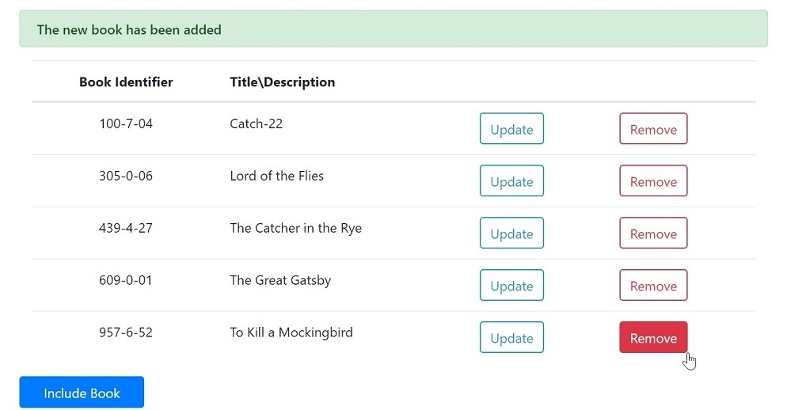

# MyPersonalLibrary
This is a full stack application for managing a Personal Library.

 

## Additional Description
Here are some of the technologies used:
- Java Development Kit
- Eclipse for Java Developers
- Node.js and npm (Node Package Manager)

For even more information, please refer to the file [Application-Guide.pdf](./Application-Guide.pdf)

## References
Spring Boot Tutorial article[^1]
[^1]: https://www.springboottutorial.com/
